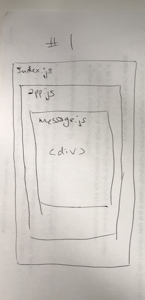

## LAB: Testing & Deployment

### Author: Becca Lee

## Assignment 1: Props Practice

### Part 1

### Links and Resources

- [props practice code sandbox site](https://r322p6ym4.codesandbox.io/)
- [props practice code sandbox repo](https://codesandbox.io/s/r322p6ym4)

### Modules
- `index.js` contains all functionality
- `public/index.html` contains the React boilerplate

### Part 2

### Links and Resources

- [modularized props practice code sandbox site](https://247l52p2o0.codesandbox.io/)
- [modularized props practice code sandbox repo](https://codesandbox.io/s/247l52p2o0)

### Modules

#### `modulename.js`

##### Exported Values and Methods

- `public/index.html` contains the React boilerplate
- `src/app.js` contains the public core app functionality
- `src/components/message/message.js` contains the message functionality
- `src/index.js` renders the whole app
- `src/styles.css` contains minor styling

#### UML

## Assignment 2: Internal State Practice

### Part 1

### Links and Resources

- [internal state practice code sandbox site](https://pprxpwo1lq.codesandbox.io/)
- [internal state practice code sandbox repo](https://codesandbox.io/s/pprxpwo1lq)

### Modules
- `index.js` contains all functionality
- `public/index.html` contains the React boilerplate

### Part 2

### Links and Resources

- [modularized internal state practice code sandbox site](https://nnl2lqkrn0.codesandbox.io/)
- [modularized internal state practice code sandbox repo](https://codesandbox.io/s/nnl2lqkrn0)

### Modules

#### `modulename.js`

##### Exported Values and Methods

- `public/index.html` contains the React boilerplate
- `src/app.js` contains the public core app functionality
- `src/components/display/display.js` contains the display functionality
- `src/index.js` renders the whole app
- `src/styles.css` contains minor styling

#### UML

## Assignment 3: External State Practice

### Part 1

### Links and Resources

- [external state practice code sandbox site](https://jz814wpq4y.codesandbox.io/)
- [external state practice code sandbox repo](https://codesandbox.io/s/jz814wpq4y)

### Modules
- `index.js` contains all functionality
- `public/index.html` contains the React boilerplate

### Part 2

### Links and Resources

- [modularized external state practice code sandbox site](https://j4xxy5nk39.codesandbox.io/)
- [modularized external state practice code sandbox repo](https://codesandbox.io/s/j4xxy5nk39)

### Modules

#### `modulename.js`

##### Exported Values and Methods

- `public/index.html` contains the React boilerplate
- `src/app.js` contains the public core app functionality
- `src/components/display/display.js` contains the display functionality
- `src/components/form/form.js` contains the display functionality
- `src/index.js` renders the whole app
- `src/styles.css` contains minor styling

#### UML

